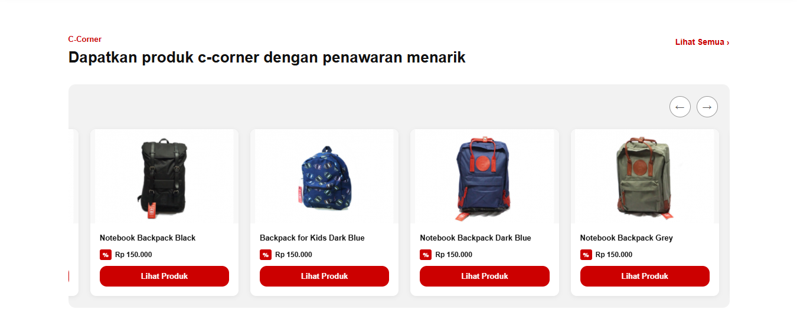
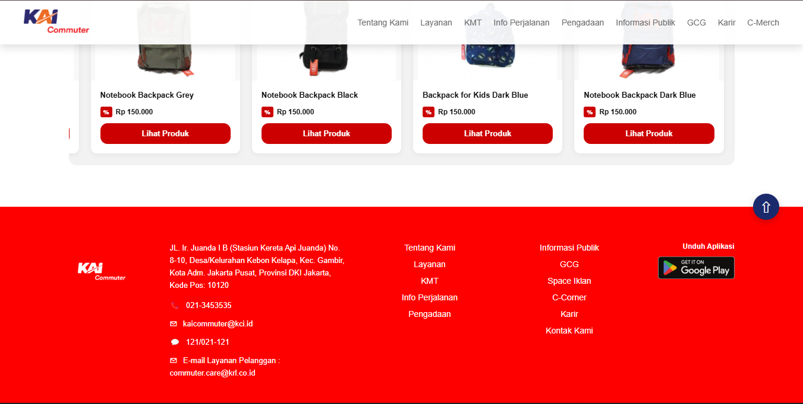

# Slicing web KCI (Kereta Commuter Indonesia)

WEB ini merupakan percobaan slicing web KAI Commuter menggunakan HTML, CSS dan JavaScript (DOM)

# fitur
- Responsive design (desktop & mobile)
- Navbar interaktif + hamburger menu
- Hero section dengan animasi
- Section download aplikasi
- Carousel produk C-Corner (infinite loop) 
- Footer lengkap & responsive
 Scroll to top button
- Notifikasi sederhana (toast)

---
# SCREENSHOT

  
  
  
  

---
# Tools
- VSCODE
- HTML
- CSS
- JavaScript

---
# Struktur folder
├── index.html
├── style.css
├── script.js
└── assets/

# Fitur
1. Navbar
2. Hero Section Animasi
3. C-Corner product dengan Corusell
4. Notifikasi
5. Scroll to top
6. Mobile Responsive design
7. Footer

# Tujuan
Project ini dibuat untuk:

- Melatih kemampuan frontend (HTML, CSS, JS)
- Memahami responsive design
- Sebagai portfolio pribadi